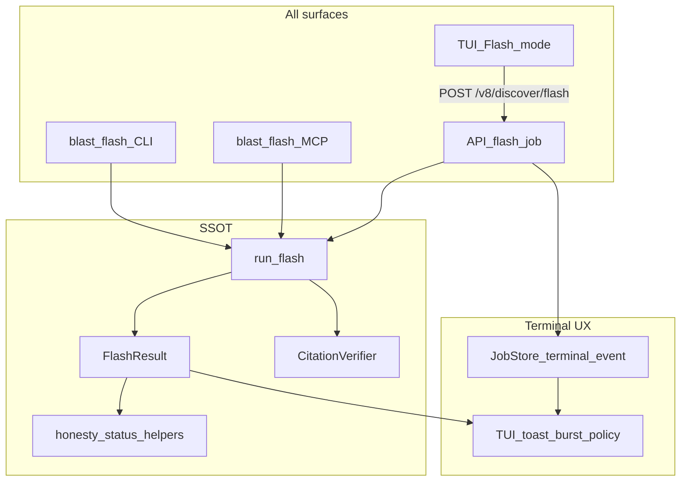

# Deep Honesty Remediation — Zero-Asymmetry Product Lock

> **For agentic workers:** REQUIRED SUB-SKILL: Use `superpowers:subagent-driven-development` (recommended) or `superpowers:executing-plans` after **explicit user approval**. Checkboxes track progress.
>
> **Status:** CODE COMPLETE on `fix/zero-asymmetry-honesty`. **W10 live Windows AISI waived 2026-07-22** (maintainer; optional external re-test later). Release path: one MR → green main → one PyPI tag.
>
> **Upstream:** Flash CLI/MCP `run_flash` + CitationVerifier (v9.19) is the **reference implementation**. This PRD eliminates **product asymmetry**: every surface that says “Flash / sources / complete / verified / novelty” must obey the same contract — including TUI Flash on Windows (what the tester actually uses).

---

## 0. Problem statement (why the last plan was soft)

Fixing CLI `blast flash` while TUI still calls a different API (`flash_discovery`) and SSE always emits `complete` is **halftone remediation**. The Windows tester runs **TUI / pip product paths**, not our unit mocks. A professional lock requires:

1. **One Flash contract** shared by CLI, MCP, API, TUI.
2. **Defense in depth** — even if one layer lies, the next refuses celebration.
3. **Surface matrix** — every entrypoint enumerated; none left “for later”.
4. **Risk register** — every known failure mode has a mitigation + regression test.
5. **Live Windows gate** — AISI 440C via the same path the tester uses.

---

## 1. Goal

Ship a product where:

- **TUI Flash on Windows** shows the same honesty as `blast flash --sources` (verified sources, partial on weak results, no fake complete).
- **SSE / Discover / Multi / Turbo / Solve / MCP / Factory** cannot paint success for stub, rate-limit, unverified sources, empty novelty, or engine fallbacks.
- **OpenRouter 429**, optional **Traefik VPS** example, **Agda** verifier honesty (+ rewrite scaffold), and **live AISI 440C** are in-scope gates — not footnotes.

**Non-goal:** Full Agda-core rewrite of the entire pipeline in one merge; treating Traefik as primary end-user product; solving corporate SSL MITM as a feature.

---

## 2. Non-negotiable invariants (anti-asymmetry)

These are merge blockers. Violating any = PR fails review.

| ID | Invariant |
|---|---|
| **I1** | There is exactly **one** Flash implementation: `run_flash` → shared result schema. CLI, MCP, API job, TUI all consume it. |
| **I2** | No UI may fire `toast.complete` or celebration `burst` unless terminal status ∈ {`success`, `complete`} **and** payload honesty allows it. |
| **I3** | `sources` / mascot source count on any surface = **verified** (CitationVerifier VERIFIED\|PARTIAL) or explicitly labeled `unverified_hits` (never counted). |
| **I4** | Empty / unchecked novelty → `novelty_score: null` (never `1.0` or `0.5` placeholder). |
| **I5** | Rate-limit (429) → rotate or `partial`/`error` with `rate_limited` warning — never empty “success” answer. |
| **I6** | Fallback sim (`not_*`, `*_not_*`) → outer `partial`, never SUCCESS. |
| **I7** | Stub tools (`agent_search` string, placeholder dissertation sections) forbidden in production paths. |
| **I8** | Secrets (`secrets.env`) load on every product entry: `blast *`, API lifespan, MCP serve, Win desktop launcher. |
| **I9** | Query shaping applies to **all** search entrypoints including `search_single` / MCP `c4_search`. |
| **I10** | Live Windows AISI 440C acceptance (TUI Flash **or** CLI flash after TUI path proven equivalent) is required before calling the PRD done. |

---

## 3. Shared contracts (SSOT types)

### 3.1 `FlashResult` (Python TypedDict / Pydantic — SSOT)

```text
status: success | partial | error
answer: str
sources: list[CitationCard]          # verified only
unverified_hits: list[CitationCard]  # not counted
verified_count: int
found_count: int
warnings: list[str]
search_meta: { domain, sources_used, errors, tavily }
usp_context?: dict
```

`CitationCard`: title, authors, year, doi, url, source, verified, verify_verdict.

### 3.2 `JobTerminalEvent` (SSE)

```text
type: complete | partial | failed
status: success | partial | aborted | failed | error
progress: float
result: <payload including status>
```

**Rule:** `JobStore` must **not** emit `type=complete` when `result.status` ∈ {partial, aborted, failed, error}.

### 3.3 TUI celebration policy

| Incoming status | Toast | Burst | Card Status |
|---|---|---|---|
| success / complete | toast.complete | yes | done |
| partial / aborted | toast.partial | **no** | partial |
| failed / error | toast.failed | **no** | error |
| missing status | toast.partial (fail-closed) | **no** | partial |

Apply to: Flash, Multi, Discover SSE `handleCompleteEvent`, poll path.

---

## 4. Surface matrix (must all pass)

| Surface | Today | Required end state | Risk if skipped |
|---|---|---|---|
| CLI `blast flash` | `run_flash` ✅ | Keep + regression | Low |
| MCP `blast_flash` | `run_flash` ✅ | Keep + schema parity test | Medium |
| API `POST /v8/discover/flash` | `flash_discovery` ❌ | **Replace body with `run_flash`** (same job envelope) | **P0 — tester TUI** |
| TUI Flash mode | hits old API + always celebrate ❌ | New API + celebration policy | **P0** |
| TUI Discover SSE | `set_complete` always ❌ | JobTerminalEvent honesty | P0 |
| TUI Multi | always celebrate ❌ | Aggregate status policy | P1 |
| CLI turbo | mascot partly honest | Source counts verified; gates demote | P0 counts |
| CLI solve | green ✓ soft | Outer honesty + mascot | P1 |
| CLI turbofactory | always done ❌ | Aggregate child status | P1 |
| MCP solve/turbo/search | raw len(sources) ❌ | verified / shaped query | P0 |
| API FastAPI | no secrets.env ❌ | lifespan apply | P1 |
| Win desktop bat | no secrets ❌ | apply secrets | P1 |
| Agent daemon search | stub string ❌ | real gather or unavailable | P0 |

**Explicit ban:** shipping “CLI fixed, TUI later” is rejected by this PRD.

---

## 4.1 Improve-don't-gut policy (anti-halftone / anti-deletion)

Learned product rule: **prefer finishing and integrating real backends over disabling features or honest-but-empty refusals.**

This PRD must **upgrade** capabilities. The following are **forbidden “fixes”**:

| Forbidden | Required instead |
|---|---|
| Delete TUI Flash C4/TRIZ/hypothesis path and leave only bare Q&A | **Compose:** `run_flash` (answer + verified sources) **plus** keep framing (`c4_path`, `triz_principles`) and optional hypothesis generated **from verified papers** when useful |
| Remove search tool / return “unavailable” as first choice | Wire `agent_search` to real `gather_flash_sources` / MultiSourceSearcher |
| Disable AMUSE / Rebound | Keep Rebound fallback; label `partial` + `not_amuse` (capability remains) |
| Disable Agda / remove bridge | Honest `unavailable` when missing; improve install path; keep bridge |
| Turn off Tavily / web when unverified | Still search; show `unverified_hits`; verify when APIs work |
| Novelty null that hard-fails all gates blindly | Gates treat `null` as **unchecked** (skip or soft-warn), not as “novelty=0 fail” |
| Delete turbofactory / multi because celebration was wrong | Fix status aggregation; keep factory |
| Remove Traefik example | Fix/validate compose; clarify optional |
| “Partial everywhere” so nothing ever succeeds | Success remains when work is real (verified≥1, gates pass, sims with positive `engine_truth`) |

### Flash composition (hard decision — supersedes naive “replace only”)

Current `flash_discovery` does: C4 → TRIZ → knowledge → **1 hypothesis** (TUI renders `hypothesis` card).
Current `run_flash` does: multi-source → CitationVerifier → **grounded answer** + verified sources.

**Naive replace = feature loss** (loses C4/TRIZ/hyp card UX).

**Required end state for Flash (all surfaces):**

```text
FlashResult = {
  ...run_flash fields (answer, sources verified, unverified_hits, status),
  c4_path?: ...,          # keep from navigate_c4 (cheap, real)
  triz_principles?: ...,  # keep from resolve_triz (cheap, real)
  hypothesis?: { text, source }  # optional: generate from verified papers + answer;
                                 # if generation fails → omit or partial, never fake text
}
```

Implementation order inside W1:

1. API/TUI switch to `run_flash` for honesty core (answer + sources + status).
2. **Re-attach** C4 + TRIZ into the same job (already pure functions — do not drop).
3. Hypothesis: generate when `verified_count ≥ 1` or `deep=true`; else skip honestly (partial if user expected hyp).
4. TUI: render answer **and** hypothesis card when present; never celebrate on partial.

This is an **upgrade** (honest citations + framing + hyp), not a downgrade to CLI-only Q&A.

---

## 5. Risk register (foresee → mitigate → lock)

| Risk | Likelihood | Impact | Mitigation | Lock |
|---|---|---|---|---|
| R1 TUI still on old flash_discovery | High | Tester never sees fix | Composer calls `run_flash` + keeps C4/TRIZ/hyp (§4.1); no dual Flash | Contract test: route uses run_flash |
| R1b Naive replace guts hyp/C4/TRIZ | High | Feature deletion | §4.1 compose policy; TUI still gets hypothesis when generated | Golden FlashResult fixture with hyp+sources |
| R2 API honest but TUI ignores status | High | Still celebrate | Celebration policy in Go + tests; fail-closed on missing status | `update.go` unit tests |
| R3 SSE complete + result.partial | High | Discover celebration | JobStore derives event type from result.status | jobs.py + API test |
| R4 Dual Flash implementations drift | Med | Asymmetry returns | Single composer; CI grep forbids new flash answer builders | `tests/test_flash_surface_parity.py` |
| R5 Verified count only on flash | High | Turbo green-fake | Shared `count_sources(papers)` helper used by Phase B / MCP / quality | Import from one place |
| R6 NoveltyScorer 1.0 empty | High | Gate bypass | Return null; callers treat null as unchecked (R25) | test_novelty_empty_null |
| R7 CitationVerifier offline → empty UX | Med | Looks “broken search” | Still return `unverified_hits` + answer; status partial; **do not** disable search | UX copy + test |
| R8 OpenRouter 429 silent empty | High | Fake answers | RateLimited type; rotate; partial | mocked 429 tests |
| R9 Free-tier rotate burns all keys | Med | Outage | Cap rotates; cooldown; prefer local/LM Studio when set | retry policy test |
| R10 secrets.env missing on API/TUI desktop | High | Tavily off, thin sources | Lifespan + bat + MCP entry | integration smoke |
| R11 search_single unshaped spray | Med | 400/414 noise | Shape in search_single | long-query test |
| R12 AMUSE rebound SUCCESS | Med | Sim green-fake | Keep fallback; partial + `not_amuse`; matcher infix | honesty_status test |
| R13 agent_search stub | High | Agent lies | **Prefer** wire real gather; unavailable only on hard fail | daemon tool test |
| R14 demo_auth from toml | Med | Auth bypass live | Only `--demo` / explicit env | paths.py test |
| R15 models.json ignored by gateway | Med | Config theatre | Wire phase when known; document fallback | model_assignment test |
| R16 Live Win not run | High | Ship blind | W10 mandatory gate | Acceptance log / waiver |
| R17 Traefik example bitrot | Med | Maintainer trap | Validate compose; pip-first banner | compose config CI |
| R18 Agda missing painted verified | Med | Formal green-fake | not_installed → unavailable (keep bridge) | verifier test |
| R19 Partial Agda rewrite scope creep | Med | Blocks ship | W9.2 scaffold only; explicit non-goal | ADR |
| R20 Corporate proxy SSL | Low/env | Install fail | Docs tip only | INSTALL note |
| R21 OpenAPI/Go client stale after API change | Med | TUI calls wrong shape | Regen oapi; Go compile in CI | go test |
| R22 Flash API sync vs async job mismatch | Med | TUI timeout/wrong parse | Keep job+SSE envelope; result embeds FlashResult | api_test.go |
| R23 Quality score greens deep flash on unverified | Med | UI theatre | Score only verified + passed | flash_runner test |
| R24 Parallel PR regresses flash_runner | Med | Undo honesty | Regression suite in default CI path | listed tests required |
| R25 Novelty null breaks gates | Med | Pipeline over-fails | Gates: null = unchecked (warn/skip), not score 0 fail | quality gate unit test |
| R26 Partial-only product never succeeds | Med | User thinks app broken | Success path preserved when verified≥1 / real sim / gates pass | AISI live expects success **or** honest partial with hits |
---

## 6. Architecture (target)



**Chosen Flash API approach (hard decision):**

1. Keep URL `POST /v8/discover/flash` (no TUI URL churn).
2. Job body = **composed Flash** (§4.1): `run_flash` + C4 + TRIZ + optional hypothesis from verified context — **not** a destructive one-way replace that deletes framing/hyp.
3. Old standalone `flash_discovery` logic is folded into the composer (reuse `navigate_c4` / `resolve_triz` / `generate_hypothesis`), not left as a second competing Flash.
4. Regenerate OpenAPI / Go client if schema fields added (`answer`, `sources`, `verified_count`, keep `hypothesis` optional).

**Defense in depth:** JobStore honesty **and** TUI celebration policy both enforced (either alone is insufficient — see R2/R3).

---

## 7. Workstreams

### W0 — Contract scaffolding (do first; unblocks everything)

- [x] Add `FlashResult` TypedDict/Pydantic in `src/knowledge/flash_contract.py` (or extend flash_runner exports).
- [x] Add `count_verified_sources` / `sanitize_biblio_row` shared helpers used by flash + Phase B + MCP.
- [x] Add `JobTerminalStatus` helper: `derive_terminal(result_status) -> complete|partial|failed`.
- [x] Document invariants I1–I10 in `docs/HONESTY_CONTRACT.md` § Flash surfaces.
- [x] Checklist test file `tests/test_flash_surface_parity.py` (CLI schema == MCP schema keys).

### W1 — TUI + API Flash + SSE (kill asymmetry)

**Files:** `discovery/pipeline.py`, `discovery_v8.py`, `jobs.py`, `src/tui/v9/update.go`, `api/api.go`, `commands.go`, `model.go`, oapi regen.

- [x] W1.1 API flash job → composer: `run_flash` + C4 + TRIZ + optional hypothesis (§4.1) — **do not delete framing/hyp capability**.
- [x] W1.2 JobStore: terminal event from `result.status` (never force complete).
- [x] W1.3 TUI Flash: parse FlashResult (`answer`, `sources`, optional `hypothesis`); celebration policy table.
- [x] W1.4 `FlashAndWait`: propagate failed/partial (no silent success).
- [x] W1.5 Multi + Discover poll/`handleCompleteEvent`: same policy.
- [x] W1.6 Go tests + Python API tests for partial payload → no complete toast; fixture with hyp+verified sources still renders.
- [x] W1.7 OpenAPI/Go client regen; `go test ./...`.

### W2 — Novelty + source counts (solve/turbo/MCP)

- [x] NoveltyScorer empty → `None`; synthesis + agenda + discovery_utils cleaned.
- [x] Phase B: keep `doi`; strip Scholar/example.com; use shared sanitize.
- [x] MCP/CLI: report `verified_count` / `sources` = verified cards; optional `unverified_hits`.
- [x] `outer_status_from_hil_like`: missing quality report + sources requested → partial.
- [x] Quality gates: demote when zero checkable DOI|URL if min_sources_with_url > 0.

### W3 — Stubs, sims, search shaping

- [x] `agent_search` → **wire** `gather_flash_sources` / MultiSourceSearcher (unavailable only on hard failure).
- [x] AMUSE Rebound → keep fallback; `partial` + `not_amuse`; honesty matcher handles `*_not_*`.
- [x] `search_single` applies `_shape_search_query` (better hits, not fewer features).
- [ ] Replace placeholder dissertation builder with real content path or honest error (no fake “Literature content”); live_feed real abs URLs; turbofactory aggregate status (factory stays).

### W4 — Secrets + Windows packaging

- [x] API lifespan + MCP module entry + Win `launcher.bat` → `apply_config_to_env` / secrets.env load.
- [ ] `--story` both forms; `tui_launcher` OSError UX; demo_auth only with `--demo`.

### W5 — Config theatre + soft gates

- [x] Gateway/stage paths honor ModelAssignment when phase known.
- [ ] Quality/prove/phase_e/solve mascot: no completed-success on soft fail.

### W6 — P2 polish

- [x] Help overlay shortcuts; keymap docs; sim `available`≠`success` color; uninstall returncode; REPL version; flash footer wording; WebSearchPlugin quarantine; landing Scholar scrub optional.

### W7 — OpenRouter 429

- [x] `RateLimited` error type; Retry-After; rotate free-tier/local; all-exhausted → partial + warning.
- [x] Tests mocked 429; HONESTY_CONTRACT rate-limit clause.
- [x] Cap rotation depth to avoid key burn (R9).

### W8 — Traefik VPS optional

- [ ] Validate/fix `examples/hosting/docker-compose.vps-traefik.yml`; healthchecks; secrets docs.
- [ ] INSTALL banner: pip-first; VPS optional.
- [ ] `docker compose config` in CI or script.

### W9 — Agda

- [x] W9.1 Verifier: not_installed → unavailable; Win honest skip; tests.
- [ ] W9.2 ADR + module-boundary scaffold; optional CI-skippable Agda stub; **non-goal:** full pipeline rewrite.

### W10 — Live Windows AISI 440C (product gate)

- [ ] Run on Windows (tester machine or equivalent):
  `blast flash --sources "…AISI 440C…"` **and** TUI Flash same question against local/API with `run_flash`.
- [ ] Pass: materials allowlist, tavily visibility, verified≥1 **or** honest partial, no celebrate on partial, 429→rotate/partial.
- [ ] Sanitized log retained; **PRD not done** without log or explicit user waiver after attempt. *(checklist row: **live log pending** in `docs/WINDOWS_FLASH_ACCEPTANCE.md`)*
- [ ] Optional manual CI job supplements — does not replace Win gate.

---

## 8. Delivery sequence (dependency order)

```text
W0 contracts
 → W1 API+TUI+SSE Flash lock          ⎫ must land together
 → W2 novelty + source counts         ⎬ core honesty
 → W7 429 handling                    ⎭ before live E2E
 → W3 stubs/sims/shaping
 → W4 secrets/Windows packaging
 → W5 models/soft gates
 → W8 Traefik example
 → W9 Agda
 → W6 polish
 → W10 live Windows AISI 440C         ← final product gate
 → Docs (HONESTY_CONTRACT, CHANGELOG, WINDOWS_FLASH_ACCEPTANCE)
```

**Merge rule:** Do not merge W1 partially (API without TUI policy, or TUI without API). Ship W1 as one MR if needed.

---

## 9. Test / lock strategy

| Layer | Required |
|---|---|
| Unit | novelty null; search_single shape; RateLimited; AMUSE partial; JobStore terminal derive; FlashResult schema |
| Contract | CLI vs MCP vs API flash key parity; celebration policy table |
| Go | flashResultMsg / multi / complete event mapping |
| Regression CI | `tests/test_flash_*`, `test_wave0_*`, `test_workstream_bc_*`, `test_citation_*`, new parity/429/jobs tests |
| Live | W10 Windows AISI 440C CLI + TUI Flash |

---

## 10. Done definition (strict)

- [ ] I1–I10 all true *(I10 blocked on live Windows log)*
- [ ] Surface matrix: every row “Required end state” verified
- [ ] Risk register R1–R24 each mitigated or explicitly accepted by user in writing
- [x] W1 shipped atomically (API `run_flash` + JobStore + TUI policy)
- [ ] Windows tester path (TUI Flash) demonstrates flash_runner honesty *(pending W10 log)*
- [ ] Live AISI 440C log reviewed or waived after attempt
- [x] HONESTY_CONTRACT + CHANGELOG + acceptance checklist updated
- [x] User approved this plan before coding started

---

## 11. Approval

Reply **approve** / **implement** (or request edits).
**Approved — implementation in progress on `fix/zero-asymmetry-honesty`.**

This revision’s intent: no more “main risk is asymmetry we left for later” — asymmetry is the primary bug this PRD exists to erase.
