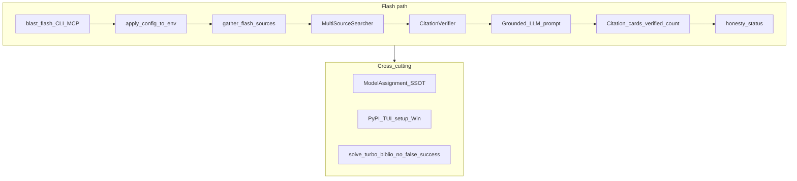

# Full Flash Honesty + Windows Systemic Audit Remediation

> **For agentic workers:** REQUIRED SUB-SKILL: Use `superpowers:subagent-driven-development` (recommended) or `superpowers:executing-plans` to implement this plan task-by-task after **explicit user approval**. Steps use checkbox (`- [ ]`) syntax for tracking.
>
> **Status:** PLAN FOR APPROVAL — do not implement until the user explicitly approves.

**Goal:** Close every defect found by the Windows tester (c4reqber 5.7.6 bug report D1–D7) and every finding from the Windows systemic audit (F1–F15), with regression locks for items already fixed in-tree, so the product is not left half-broken.

**Architecture:** One shared flash runner → secrets.env applied → MultiSourceSearcher (shaped query + domain routing + Tavily when keyed) → CitationVerifier → grounded LLM prompt → citation cards + verified-only counts + honesty status. One ModelAssignment SSOT for LLM routing. Packaging/CI locks for secrets_store, TUI binary, and `python -m pip`.

**Tech Stack:** Python CLI/MCP (`blast`), `MultiSourceSearcher`, `CitationVerifier`, Go TUI v9, hatch/GitLab wheel packaging, pytest honesty suites, `docs/HONESTY_CONTRACT.md`.

## Global Constraints

- Scope is the **union** of: flash/sources/citations cluster (D1–D7 + related) **and** full F1–F15 **and** Windows blockers needed for tester acceptance. No “fix only P0-1 first” deliverable; dependency order below is sequencing, not truncation.
- Honesty SSOT: `docs/HONESTY_CONTRACT.md` — never paint success/verified/complete for stub, heuristic, fallback, or unverified sources.
- Primary remote is GitLab; do not claim GitHub as product home.
- Do not commit secrets; never touch `.env.dontredact` cleanup.
- Wait for explicit approval before coding; after approval, finish the full set before calling the work done.
- Out of scope: corporate proxy/SSL/429, Traefik VPS, maintainer-Mac Docker, GitLab Environment Play, Desktop app marketing, Agda-core rewrite.

---

## Product outcome (tester acceptance)

Command (Windows / pip):

```text
blast flash --sources "find exactly one real peer reviewed publication specifically about cryogenic treatment of AISI 440C steel"
```

| Criterion | Pass condition |
|---|---|
| Query | Shaped keywords hit APIs — not the full English instruction; irrelevant adapters (PubChem compound-name, ClinicalTrials, UCI ML, HF datasets, CERN OD) not sprayed for materials lit queries |
| Hits | ≥1 paper with full title + DOI **or** URL (authors/year when available) |
| Answer | Does **not** claim “unable to find” when verified sources exist; cites them |
| Sources UI | Full citation cards — not `title[:60]`-only; never `example.com` |
| Count | Footer `N sources` = **verified only**; else `0 verified sources` + status `partial`/`failed` |
| Log | Explicit `sources_used`, Tavily on/off/no_key, error counts — no secret values |
| Secrets | Key in `~/.c4reqber/secrets.env` is visible to `blast flash` |
| ST missing | Controlled warning + lexical fallback; does not tank trust of the result |

Plus regression coverage for all F1–F15 (below).

---

## Current triage (repo 9.x vs tester wheel 5.7.6)

| ID | Status in current tree | Required action in this PRD |
|---|---|---|
| F1 example.com WebSearchPlugin | looks fixed | Regression lock |
| F2 fake biblio padding | looks fixed | Regression lock |
| F3 models.json wiring | **partial** | Finish AsyncLLMClient + TUI save path |
| F4 UnboundLocal synthesis | looks fixed | Regression lock |
| F5 query shaping | looks fixed in orchestrator | Ensure flash uses it + **domain routing (D1)** |
| F6 Tavily in SOURCE_REGISTRY | looks fixed | Activate via secrets load (D5) + log visibility |
| F7 secrets_store in wheel | looks fixed | Packaging/CI assert |
| F8 TUI binary Windows | **partial** | Ship/download `.exe`; fail publish if missing |
| F9 `pip pip install` | looks fixed | Regression lock |
| F10 `config --health` | looks fixed | Regression lock |
| F11 retry model IDs | looks fixed | Regression lock |
| F12 false success UX | **partial** | CLI flash/mascot + novelty null |
| F13 CLI vs MCP flash | **partial** | Shared runner |
| F14 Scholar/DOI hallucination | **partial** | Strip + verify on flash/turbo/solve |
| F15 Win unixisms | **partial** | Win paths + honest verifier skip/installer |
| D1 domain routing flash | **broken** | Infer domain → `search_all(domain=)` |
| D2 LLM grounding | weak | Hard rule: papers ⇒ cite / no “not found” |
| D3 citation cards | **partial** | DOI+URL+source on CLI+MCP |
| D4 verified count | **broken** | CitationVerifier; count verified only |
| D5 secrets.env on flash | **broken** | `apply_config_to_env` at CLI startup |
| D6 sentence-transformers fallback | **partial** | TF-IDF/hash fallback; quiet warning |
| D7 Tavily opacity | **broken** | Print `sources_used` / errors |



---

## File map

| Area | Primary paths |
|---|---|
| Flash CLI/MCP | `src/cli/blast_core.py`, `src/cli/blast_app.py`, `src/mcp_server/tools_blast.py`, `src/knowledge/flash_sources.py` |
| Search / domain | `src/knowledge/orchestrator.py`, `src/knowledge/config.py`, `src/knowledge/sources/tavily.py` |
| Citations | `src/knowledge/citation_verifier.py`, `src/pipeline/quality.py`, HIL phase B/F |
| Secrets | `src/config/paths.py`, `src/config/secrets_store.py` |
| LLM wiring | `src/llm/model_assignment.py`, `src/llm/async_client.py`, `src/llm/router.py`, `src/llm/retry_pkg/policies.py` |
| Synthesis / honesty | `src/agents/pipeline/steps/step_08_synthesis.py`, `src/agents/pipeline/executor.py`, `src/utils/honesty_status.py` |
| TUI models | `src/tui/v9/models_menu.go` |
| Packaging / Win | `hatch_build.py`, `scripts/ci/prepare_tui_wheel.sh`, `.gitlab-ci.yml`, `src/cli/tui_binary.py`, `src/cli/package_manager.py`, `src/simulations/newton_bridge.py` |
| Docs | `docs/HONESTY_CONTRACT.md`, `CHANGELOG.md` |
| Tests | `tests/test_flash_sources.py`, `tests/test_wave0_sources_honesty.py`, `tests/test_citation_openalex_honesty.py`, `tests/test_mcp_honesty_status.py`, new `tests/test_flash_grounding_honesty.py` |

---

## Workstream A — Flash / sources / citations (D1–D7 + F1/F2/F5/F6/F13/F14)

### Task A1: Shared flash runner (F13)

- [ ] Write failing tests: CLI and MCP flash produce the same source schema keys and honesty status for the same mocked gather result.
- [ ] Extract `run_flash(question, *, with_sources, deep, format)` used by `cmd_flash` and `blast_flash`.
- [ ] Route both entrypoints through it; delete duplicated prompt/status logic.
- [ ] Run targeted tests; commit when green.

### Task A2: secrets.env on every CLI entry (D5, unlocks F6)

- [ ] Write failing test: with only secrets.env providing `TAVILY_API_KEY`, flash path resolves the key (mock `get_key` / env after apply).
- [ ] Call `apply_config_to_env()` / `load_secrets_env()` once at `blast_app` startup (not only `tui`/`serve`).
- [ ] Confirm Tavily adapter activates when keyed; log `tavily=on|off|no_key`.
- [ ] Run tests; commit.

### Task A3: Domain routing + lit-only spray control (D1, F5)

- [ ] Write failing tests: materials/cryogenic query does not dispatch PubChem/ClinicalTrials/UCI/HF-datasets/CERN; shaped query ≠ full instruction.
- [ ] Add `infer_query_domain(question)` using `DOMAIN_KEYWORDS`.
- [ ] `gather_flash_sources` → `search_all(..., domain=inferred, include_web=True)` (orchestrator already shapes via `_shape_search_query`).
- [ ] Skip or deprioritize irrelevant adapters for lit domains.
- [ ] Run tests; commit.

### Task A4: Rich context + grounded prompt (D2)

- [ ] Write failing test: when papers non-empty, prompt/context forbids “unable to identify / not found” answers; context includes DOI/URL.
- [ ] Enrich `gather_flash_sources` context block: title, authors, year, doi, url, `_source`, snippet.
- [ ] Harden CLI/MCP prompt: if verified sources exist → must cite; no cutoff-only excuse.
- [ ] Run tests; commit.

### Task A5: Citation cards + verified count (D3, D4, F14)

- [ ] Write failing tests: entries without DOI|URL excluded from verified count; Scholar `?q=` URLs rejected; MCP payload includes doi/url/verified.
- [ ] CLI cards: full title (wrap OK), DOI, URL, source engine.
- [ ] MCP: `{title, authors, year, doi, url, source, verified}`.
- [ ] Run `CitationVerifier` (OpenAlex title sim ≥ 0.82 / DOI) on flash sources.
- [ ] Footer: `verified=N found=M`; mascot/count uses verified only.
- [ ] Strip `scholar.google.com/scholar?q=` and drop DOIs that fail verify in flash **and** turbo/solve biblio writers.
- [ ] Run tests; commit.

### Task A6: Provider transparency (D7)

- [ ] Write failing test: flash output/summary includes `sources_used` and error map without secrets.
- [ ] Print at end of flash: adapters used, error counts, `tavily=on|off|no_key`.
- [ ] Run tests; commit.

### Task A7: sentence-transformers fallback (D6)

- [ ] Write failing test: without `sentence_transformers`, dedup still returns deterministic lexical result; one warning; no hard crash.
- [ ] In orchestrator dedup path: TF-IDF/hash fallback (pattern from `src/analogy/utils.py`); quiet warning.
- [ ] Run tests; commit.

### Task A8: Regression locks (F1, F2)

- [ ] Confirm/extend tests: `WebSearchPlugin` returns `[]`; no `example.com`; no biblio padding; `QualityGates.check_sources` hard-fails dummies.
- [ ] Run `tests/test_wave0_sources_honesty.py`; commit if any gaps closed.

---

## Workstream B — Config → runtime wiring (F3, F4, F11, F12)

### Task B1: ModelAssignment SSOT (F3)

- [ ] Write failing tests: `AsyncLLMClient` / stage path uses `get_model_for_phase` / models.json assignment; TUI save persists config.
- [ ] Wire `AsyncLLMClient.generate` (and stage entrypoints that still hardcode) through ModelAssignment.
- [ ] TUI `models_menu.go`: Enter saves via `blast config --set/--tier --save` (not display-only).
- [ ] Run Python + Go tests for touched packages; commit.

### Task B2: Synthesis fail-path regression (F4)

- [ ] Write/keep unit test: ProviderRouter fail + sync fallback does not UnboundLocal on `response`/`cost_tracker`.
- [ ] Keep init-before-branch pattern in `step_08_synthesis.py`.
- [ ] Run tests; commit.

### Task B3: Retry model IDs (F11)

- [ ] Regression test: non-OpenRouter providers never receive a foreign `org/model` string from primary.
- [ ] Confirm `_model_for_provider` uses `get_default_model(provider)`.
- [ ] Run tests; commit.

### Task B4: No false success (F12)

- [ ] Write failing tests: `--sources` + verified=0 → status `partial`/`failed`, not mascot `done` success; unchecked novelty → `null`.
- [ ] Propagate honesty status to CLI flash/mascot and pipeline completion copy.
- [ ] Abort/mark failed on empty synthesis; no green “Solution generated” on empty.
- [ ] Run tests; commit.

---

## Workstream C — Windows / PyPI packaging (F7, F8, F9, F10, F15)

### Task C1: secrets_store ships (F7)

- [ ] Assert `.gitignore` allowlists `src/config/secrets_store.py`; CI/import smoke after install simulation.
- [ ] Fix any remaining ignore/packaging hole; commit.

### Task C2: TUI on Windows (F8)

- [ ] `ensure_tui_binary` resolves `c4tui-v9.exe` / sibling `blast.exe`.
- [ ] Publish/CI: fail if platform wheel missing binary (no silent `|| true` on release artifacts).
- [ ] Document fallback download from GitLab release asset.
- [ ] Commit.

### Task C3: setup pip argv (F9)

- [ ] Regression test: install argv is `[sys.executable, "-m", "pip", "install", ...]` — never `pip pip`.
- [ ] Commit if gap found.

### Task C4: config --health (F10)

- [ ] CLI test: `blast config --health` non-empty stdout / exit 0 with health lines.
- [ ] Commit if gap found.

### Task C5: Windows unixisms (F15)

- [ ] Verifier install on win32: honest skip or PowerShell path — never fake success.
- [ ] Isolated/env probes: `Scripts/python.exe` candidates; fix hardcoded `bin/python` in `newton_bridge.py`.
- [ ] Tests/mocks for path selection; commit.

---

## Workstream D — Docs + tester checklist

- [ ] Update `docs/HONESTY_CONTRACT.md`: flash verified sources, secrets.env on all CLI, CLI/MCP parity.
- [ ] `CHANGELOG.md` entry for the remediation release.
- [ ] Short Windows acceptance checklist for the tester (AISI 440C command + F8/F9/F10 smoke).
- [ ] Commit docs.

---

## Delivery sequence (dependencies — all still in this PRD)

1. A2 + A1 — secrets + shared runner
2. A3–A7 — domain, grounding, cards, verified, log, ST fallback
3. A8 + F14 pipeline strip — locks + Scholar/DOI
4. B1–B4 — models SSOT + false success + retry/synthesis locks
5. C1–C5 — packaging/Windows
6. D — docs/changelog/checklist
7. Full gate — honesty pytest + Go compile if touched + AISI 440C acceptance (live or mocked adapters)

There is **no** separate “phase 2 PRD” for leftover F*.

---

## Done definition

- [ ] Every ID in F1–F15 and D1–D7 is either fixed or locked by a regression test that would catch reintroduction
- [ ] AISI 440C acceptance table passes
- [ ] CLI and MCP flash share source schema + honesty status
- [ ] `blast flash` loads secrets.env; Tavily appears in `sources_used` when keyed
- [ ] No `example.com` / Scholar `?q=` / unverified DOI in user-facing sources
- [ ] `models.json` affects AsyncLLMClient/stage routing; TUI can save
- [ ] Windows: setup pip, config --health, TUI binary path, verifier honesty
- [ ] CHANGELOG + HONESTY_CONTRACT updated
- [ ] User explicitly approved this plan before implementation started

---

## Approval

Reply with **approve** / **implement** (or requested edits) to start execution. Until then: no code changes from this plan.
